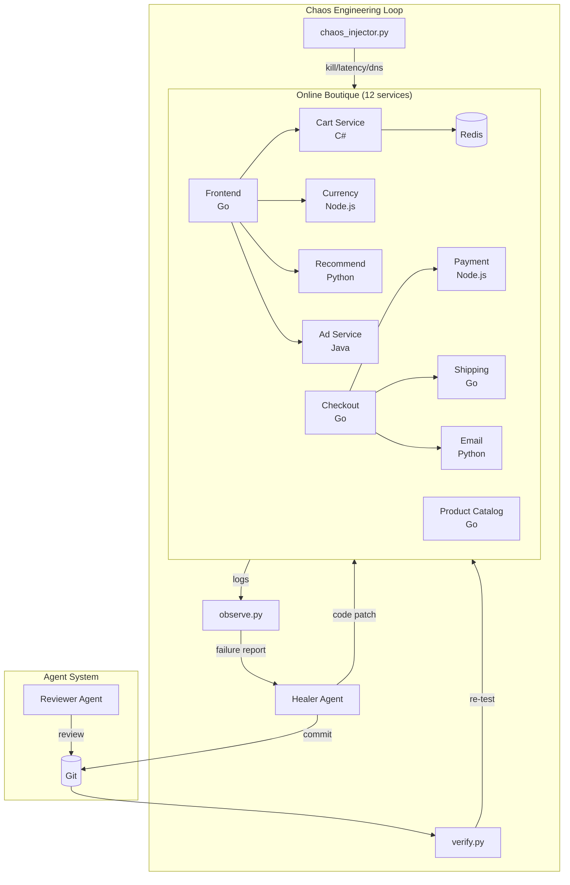

# Self-Healing Chaos Agent

> **AI agents that automatically detect microservice failures and patch them with resilience patterns.**

A chaos engineering system inspired by [Anthropic's "Building Effective Agents"](https://www.anthropic.com/engineering/building-effective-agents) that uses Claude AI to observe failures in real-time and autonomously implement fixes like retry logic, circuit breakers, and graceful degradation.

<p align="center">
  
  
  
</p>

---

## How It Works

```
┌─────────────┐     ┌─────────────┐     ┌─────────────┐     ┌─────────────┐
│   INJECT    │ ──▶ │   OBSERVE   │ ──▶ │    HEAL     │ ──▶ │   VERIFY    │
│   Chaos     │     │   Failures  │     │   with AI   │     │    Fix      │
└─────────────┘     └─────────────┘     └─────────────┘     └─────────────┘
       │                   │                   │                   │
       ▼                   ▼                   ▼                   ▼
  Kill services      Parse logs &       Claude reads        Re-inject same
  Add latency       detect errors       failure report      chaos attack
  Corrupt DNS      Generate report      Patches code       System survives
```

The system runs an autonomous loop:
1. **Inject** chaos (kill containers, add latency, drop packets)
2. **Observe** failures across the microservice mesh
3. **Heal** by having an AI agent read the failure report and implement resilience patterns
4. **Verify** the fix by re-injecting the same chaos

---

## Architecture



---

## The Agent Team

| Agent | Role | What It Does |
|-------|------|--------------|
| **Healer** | Fix failures | Reads failure reports, identifies root cause, patches source code with resilience patterns |
| **Reviewer** | Code review | Reviews healer's patches for correctness, bounded retries, proper error handling |

Both agents coordinate through:
- **PROGRESS.md** — Shared state tracker
- **current_tasks/** — File-based task locking
- **Git commits** — Versioned fixes with clear messages

---

## Resilience Patterns

The AI agents implement these battle-tested patterns:

| Pattern | When to Use | Example |
|---------|-------------|---------|
| **Retry with Exponential Backoff** | Transient connection failures | Start 100ms, double each retry, max 5, add jitter |
| **Circuit Breaker** | Latency/timeout issues | Track failures, open after N, half-open after timeout |
| **Graceful Degradation** | Non-critical dependency down | Return defaults/empty instead of 500 |
| **Timeout with Deadline** | Prevent hanging calls | Explicit gRPC/HTTP timeouts |
| **Bulkhead Isolation** | Prevent cascade failures | Separate thread/goroutine pools |
| **Idempotency** | Payment/state changes | Use idempotency keys on retry |

---

## Scenario Status

| Scenario | Target | Attack | Expected Fix | Status |
|----------|--------|--------|--------------|--------|
| `scenario_1_redis_kill` | Redis | Kill container | Retry + in-memory fallback | **PASSED** |
| `scenario_2_latency` | Currency Service | 3s latency | Circuit breaker | Pending |
| `scenario_3_payment_kill` | Payment Service | Kill container | Idempotent retry | Pending |
| `scenario_4_shipping_packetloss` | Shipping | 50% packet loss | Retry with backoff | Pending |
| `scenario_5_recommendation_crash` | Recommendation | Kill container | Graceful degradation | Pending |

---

## Quick Start

### Prerequisites

```bash
docker --version          # Docker 24+
docker compose version    # Docker Compose v2+
python3 --version         # Python 3.10+
```

### 1. Clone and Start Services

```bash
git clone https://github.com/YOUR_USERNAME/self-healing-chaos-agent.git
cd self-healing-chaos-agent

# Clone Online Boutique (target microservices)
git clone https://github.com/GoogleCloudPlatform/microservices-demo.git ../microservices-demo

# Start all services (first build takes 10-20 min)
cd ../microservices-demo
docker compose build && docker compose up -d

# Verify everything is running
cd ../self-healing-chaos-agent
./chaos-agent/healthcheck.sh
```

### 2. Inject Chaos

```bash
# Kill Redis (Cart Service will fail)
python3 chaos-agent/chaos_injector.py kill redis-cart

# Add 3 seconds latency to Currency Service
python3 chaos-agent/chaos_injector.py latency currencyservice 3000

# Restore a service
python3 chaos-agent/chaos_injector.py restore redis-cart
```

### 3. Observe Failures

```bash
# One-time failure report
python3 chaos-agent/observe.py report

# Continuous monitoring
python3 chaos-agent/observe.py monitor --interval 15
```

### 4. Run a Full Scenario

```bash
# Inject → Wait → Observe → Generate Report
python3 chaos-agent/run_scenario.py scenario_1_redis_kill

# Verify a fix works
python3 chaos-agent/verify.py scenario_1_redis_kill
```

### 5. Run the AI Agents (requires Claude Code CLI)

```bash
# Run the Healer Agent
./chaos-agent/harness.sh healer

# Run the Reviewer Agent (in another terminal)
./chaos-agent/harness.sh reviewer
```

---

## Project Structure

```
self-healing-chaos-agent/
├── chaos-agent/
│   ├── chaos_injector.py    # Inject failures (kill, latency, packetloss, dns)
│   ├── observe.py           # Monitor services, generate LLM-optimized reports
│   ├── run_scenario.py      # Orchestrate inject → wait → observe → report
│   ├── verify.py            # Rebuild, redeploy, re-test after a fix
│   ├── harness.sh           # Agent loop runner
│   ├── healthcheck.sh       # Quick health check all services
│   ├── HEALER_PROMPT.md     # Instructions for healing agent
│   ├── REVIEWER_PROMPT.md   # Instructions for reviewer agent
│   └── reports/             # Generated failure reports
├── current_tasks/           # Agent task coordination
├── verification_results/    # Fix verification results
├── PROGRESS.md              # Agent-maintained status tracker
├── IMPLEMENTATION_PLAN.md   # Detailed build guide
└── CLAUDE.md                # Claude Code guidance
```

---

## Example: Scenario 1 Fix

When Redis dies, the Cart Service (C#) was modified to include:

```csharp
// Retry with exponential backoff
private async Task<T> RetryWithBackoff<T>(Func<Task<T>> operation)
{
    int retries = 0;
    while (retries < MaxRetries)
    {
        try { return await operation(); }
        catch (RedisConnectionException)
        {
            retries++;
            var delay = InitialDelay * Math.Pow(2, retries) + Random.Next(100);
            await Task.Delay((int)delay);
        }
    }
    return _fallbackCache.GetOrDefault(key); // Graceful degradation
}
```

The system now:
- Retries failed Redis calls with exponential backoff
- Falls back to an in-memory cache if Redis is unreachable
- Returns empty cart instead of 500 error (graceful degradation)

---

## Observability Design

The `observe.py` output is optimized for LLM consumption:

```
============================================================
SYSTEM STATUS: DEGRADED
TIMESTAMP: 2026-02-22T10:30:45
HEALTHY: frontend, productcatalogservice, adservice
------------------------------------------------------------
ERROR | service=cartservice | lang=C# | status=ERRORS | errors=12 |
       cause=cartservice cannot connect to a downstream dependency
------------------------------------------------------------
ACTION: Add retry with exponential backoff in src/cartservice/src/
        for cartservice (C#) when connecting to downstream services
============================================================
```

Key principles:
- Max 10-line summaries (no log flooding)
- Pre-computed likely cause
- File paths for relevant source code
- Deduplicated error types
- Recommended actions

---

## Hardware Requirements

| Resource | Minimum | Recommended |
|----------|---------|-------------|
| RAM | 16 GB | 24 GB |
| Disk | 10 GB | 20 GB |
| CPU | 4 cores | 8 cores |

---

## Inspiration

This project was inspired by Anthropic's engineering blog posts on building effective AI agents, particularly their approach of:

- **Tight feedback loops** — inject chaos, observe immediately
- **LLM-optimized output** — no log flooding, pre-computed diagnosis
- **Agent coordination** — file-based task locking, shared progress tracking
- **Verification-driven development** — every fix is re-tested against the same chaos

---

## Contributing

1. Fork the repository
2. Create a feature branch (`git checkout -b feature/new-scenario`)
3. Commit your changes (`git commit -m 'Add scenario for database failures'`)
4. Push to the branch (`git push origin feature/new-scenario`)
5. Open a Pull Request

---

## License

MIT License — feel free to use this for learning, demos, or building your own chaos engineering systems.

---

<p align="center">
  Built with Claude AI and a healthy disrespect for uptime.
</p>
